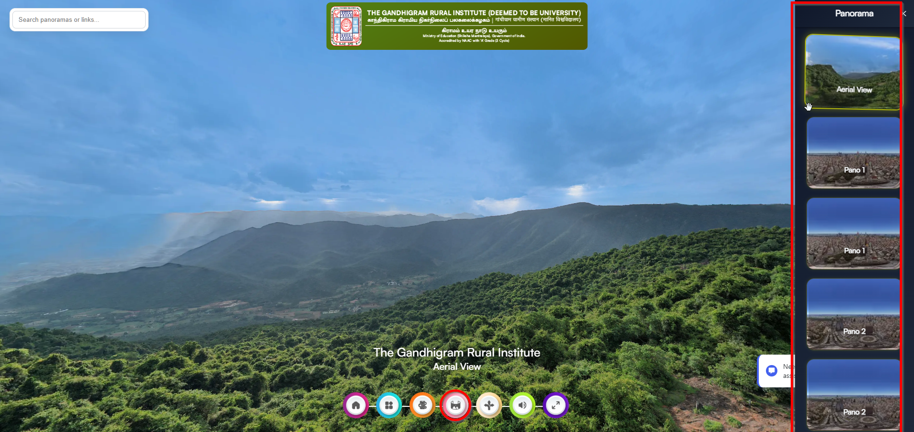
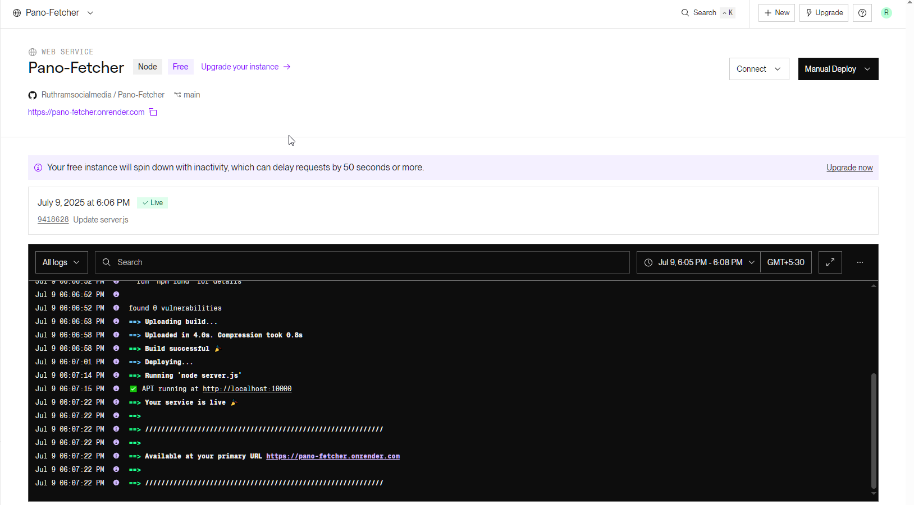

# 🛰️ Pano-Fetcher API

**Pano-Fetcher API** is a backend service built with **Node.js + Express** to parse and extract panorama thumbnail data from user-uploaded JavaScript files (`script_general.js`). It powers dynamic 360° tour interfaces by returning structured JSON metadata (`id`, `label`, `thumbnailUrl`), even from minified or CDN-hosted scripts.

---

## 🖼️ Preview

| Project Preview | API Hosting Preview |
|-----------------|---------------------|
|  |  |

---

## 🚀 Features

- Parses complex or minified `script_general.js`
- Uses **Prettier** for formatting before parsing
- Extracts structured `Panorama` metadata
- Fast and lightweight JSON API
- Plug-and-play ready for **Vista** using `Execute JS`

---

## 📁 File Structure

```
Pano-Fetcher_API/
│
├── routes/
│ └── pano.js # API endpoint logic
│
├── utils/
│ └── parser.js # Acorn-based JS parser
│
├── prettier/
│ └── format.js # Beautify logic using Prettier
│
├── screenshot/
│ ├── image.png # UI preview
│ └── imageApi.png # API response screenshot
│
├── server.js # Main Express app
└── package.json
```


---

## ⚙️ Installation & Local Setup

```bash
git clone https://github.com/thiyo-de/Pano-Fetcher_API.git
cd Pano-Fetcher_API
npm install
npm start

---

📦 API Usage
POST /api/pano/fetch
Request Body
Response Format
```
[
  {
    "id": "panorama_001",
    "label": "Main Entrance",
    "thumbnailUrl": "https://example.com/thumbs/main.jpg"
  },
  ...
]
```
